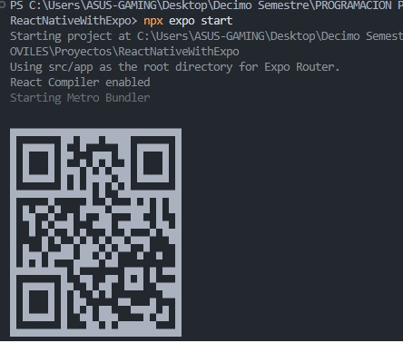
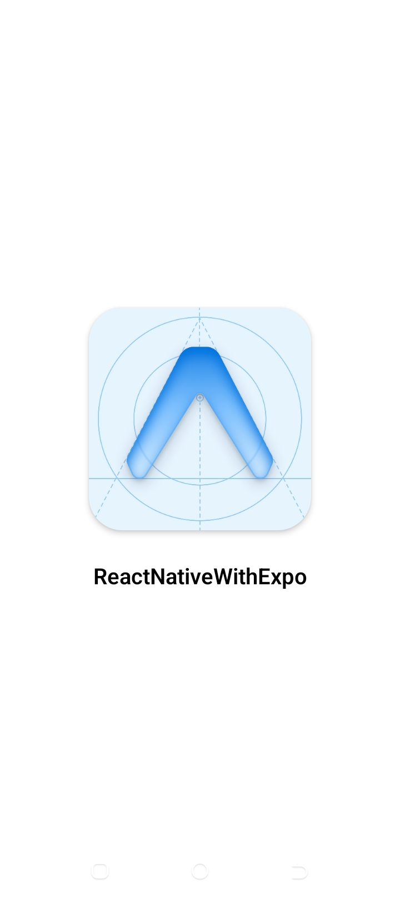
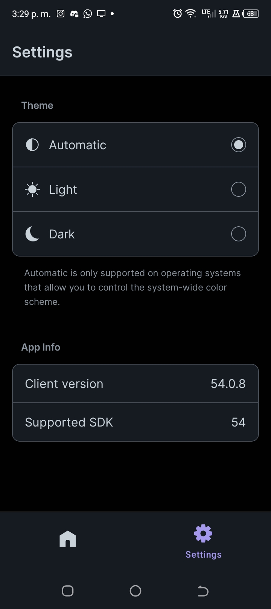
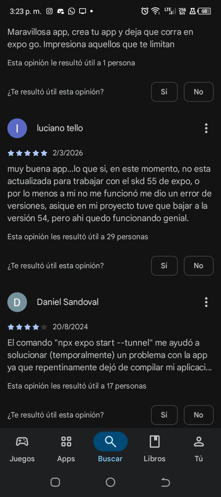
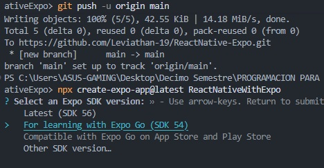
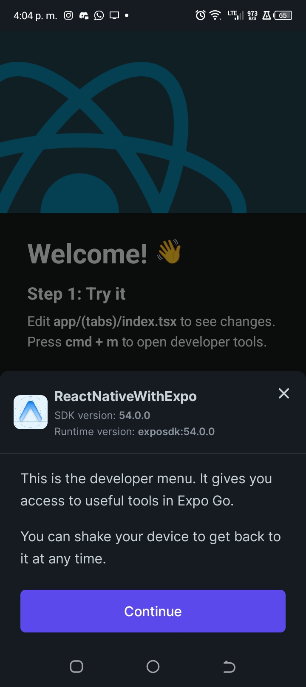

# Instalación y Configuración de React Native con Expo

Este documento describe el proceso de instalación y configuración de un proyecto **React Native** utilizando **Expo**, incluyendo los requisitos previos, herramientas recomendadas y la solución aplicada para lograr compatibilidad con la aplicación móvil **Expo Go**.

---

## 1. Instalación de Node.js

Antes de comenzar, es necesario tener instalado **Node.js**. Si no lo tienes, puedes descargarlo desde el sitio oficial:

🔗 [Descargar Node.js](https://nodejs.org/es/download)

Una vez instalado, verifica que la instalación fue exitosa ejecutando los siguientes comandos en tu terminal:

```bash
node -v
npm -v
```

En mi entorno de desarrollo, cuento con las siguientes versiones:

```bash
C:\Users\ASUS-GAMING>node -v
v24.14.1

C:\Users\ASUS-GAMING>npm -v
11.11.0
```

---

## 2. Instalación de Git

También es fundamental contar con **Git** para el control de versiones. Puedes obtenerlo aquí:

🔗 [Descargar Git](https://git-scm.com/install/)

Para verificar la instalación, ejecuta:

```bash
git --version
```

Resultado obtenido:

```bash
C:\Users\ASUS-GAMING>git --version
git version 2.53.0.windows.2
```

---

## 3. Configuración del Entorno de Desarrollo

Para este proyecto se utilizó **Visual Studio Code**. Se recomienda instalar las siguientes extensiones para mejorar la productividad:

*   **ES7+ React/Redux snippets**: Atajos para código React.
*   **React Native Tools**: Depuración y herramientas para React Native.
*   **Prettier**: Formateador de código automático.
*   **Material Icon Theme**: Iconos visuales para carpetas y archivos.
*   **Error Lens**: Resaltado de errores directamente en la línea de código.

---

## 4. Creación del Proyecto con Expo

Anteriormente, Expo se gestionaba mediante `expo-cli` de forma global:

```bash
npm install -g expo-cli
```

Sin embargo, el estándar actual es utilizar `npx` para asegurar que siempre usamos la versión más reciente sin instalaciones globales innecesarias:

```bash
npx create-expo-app@latest
```

Para inicializar este proyecto, ejecuté el siguiente comando:

```bash
npx create-expo-app@latest ReactNativeWithExpo
```

El asistente generará automáticamente la estructura del proyecto e instalará todas las dependencias. Una vez finalizado, ingresamos al directorio:

```bash
cd ReactNativeWithExpo
```

Y arrancamos el servidor de desarrollo:

```bash
npx expo start
```

---

## 5. Inicio del Proyecto y Vinculación

Al ejecutar `npx expo start`, Expo genera un **código QR** en la consola. Este código es la llave para vincular tu entorno de desarrollo con tu dispositivo físico.

### Código QR generado por Expo


---

## 6. Instalación de Expo Go en el Dispositivo Móvil

Para visualizar la aplicación en un teléfono real (Android o iOS), es necesario instalar la app **Expo Go** desde la tienda correspondiente.

Durante la carga inicial de la aplicación en el móvil, verás una pantalla de progreso:

### Pantalla de carga de Expo Go


---

## 7. Problema de Compatibilidad (SDK Version)

Al intentar escanear el código QR, es común encontrarse con errores de compatibilidad si las versiones no coinciden. Al revisar la configuración de **Expo Go** en mi dispositivo, noté que solo soportaba el **SDK 54**.

### Configuración de mi Expo Go


> **Nota:** La aplicación indicaba:
> * **Client Version:** 54.0.8
> * **Supported SDK:** 54

Investigando en la comunidad, confirmé que otros usuarios reportaban el mismo inconveniente con las versiones más recientes.

### Comentarios de usuarios en Google Play


El problema radicaba en que `npx create-expo-app@latest` generó un proyecto con **SDK 56**, incompatible con mi versión de cliente móvil.

---

## 8. Solución: Downgrade a Expo SDK 54

Para resolver esto, realicé un "downgrade" forzado a la versión compatible utilizando el siguiente comando:

```bash
npx expo install expo@~54.0.0
```

### Proceso de instalación de SDK 54


Posteriormente, ejecuté una corrección automática de dependencias para asegurar la estabilidad del proyecto:

```bash
npx expo install --fix
```

Y verifiqué la versión final:

```bash
npx expo --version
```

---

## 9. Vinculación Exitosa

Tras ajustar la versión del SDK, el escaneo del código QR funcionó correctamente. La aplicación móvil mostró los pasos finales para completar la carga.

### Pasos finales en Expo Go


Ahora, el dispositivo móvil está sincronizado y cualquier cambio guardado en el código se refleja instantáneamente (Fast Refresh).

